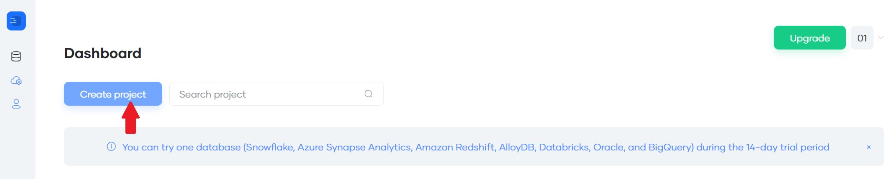

# dbmodelling_sqldbm
Cloud-native Database Modeling with SqlDBM

An entity-relationship (ER) diagram is a traditional way to visualise tables and their relationships in a relational database, making it easier to find relevant tables and understand how they can be joined for analysis.

SqlDBM simplifies this by offering a visual, no-code approach, allowing users to manipulate databases directly through an intuitive, browser-based interface. Instead of manually writing DDL, users can drag, drop, copy, and clone objects.

Changes made in SqlDBM can be forward-engineered into Snowflake-specific DDL and deployed back to the database, supporting collaboration, documentation, and version control.

After signing up to SqlDBM you'll be offered a 14-days trial. 
Create a New SqlDBM Project

 

After logging in to SqlDBM, click **Create Project**. You'll be offered to choose project type.

 

Hover over "Snowflake" as the database type and choose "Existing database."

You'll be shown a short 5-steps guide on Reverse engineer:

 

 Click the "Connect to DW" to create a live connection to Snowflake.

 

 

Select the Database and Schema you wish to import and press the "Apply" button below.

 
